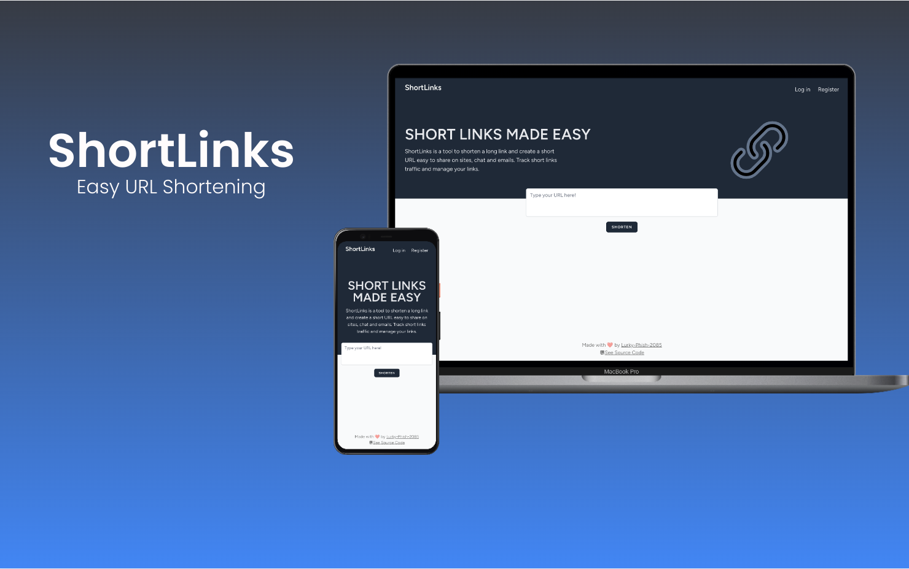
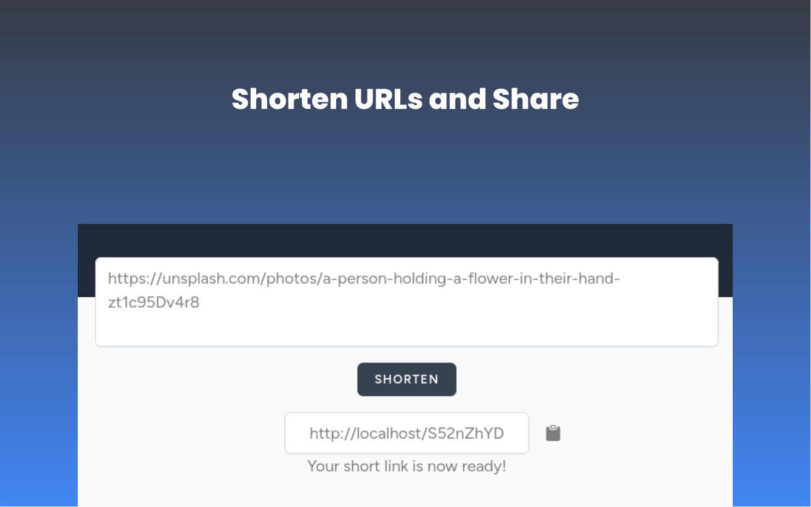

<svg width="128px" height="128px" viewBox="0 0 24 24" fill="none" xmlns="http://www.w3.org/2000/svg"><path fill-rule="evenodd" clip-rule="evenodd" d="M10.975 14.51a1.05 1.05 0 0 0 0-1.485 2.95 2.95 0 0 1 0-4.172l3.536-3.535a2.95 2.95 0 1 1 4.172 4.172l-1.093 1.092a1.05 1.05 0 0 0 1.485 1.485l1.093-1.092a5.05 5.05 0 0 0-7.142-7.142L9.49 7.368a5.05 5.05 0 0 0 0 7.142c.41.41 1.075.41 1.485 0zm2.05-5.02a1.05 1.05 0 0 0 0 1.485 2.95 2.95 0 0 1 0 4.172l-3.5 3.5a2.95 2.95 0 1 1-4.171-4.172l1.025-1.025a1.05 1.05 0 0 0-1.485-1.485L3.87 12.99a5.05 5.05 0 0 0 7.142 7.142l3.5-3.5a5.05 5.05 0 0 0 0-7.142 1.05 1.05 0 0 0-1.485 0z" fill="#000000"/></svg>

<h1 align=center>ShortLinks</h1>

## Description

ShortLinks is a tool to shorten a long link and create a short URL easy to share on sites, chat and emails. Track short links traffic and manage your links.

## Live Demo

A live demo will be available soon! For now, please see the screenshots section.

## Screenshots

